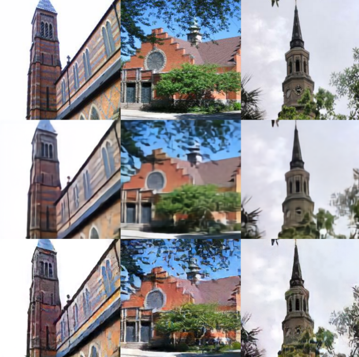

# Metroplex (WIP)

<p align="center">
  
 
 Ground truth (top), VQ-VAE (middle), DC-VAE (bottom)
</p>

Metroplex is a minimalistic JAX/Flax-based VAE codebase. A user can customize a model by switching as: 
- Discrete VAE ([VQ-VAE](https://arxiv.org/abs/1711.00937)) vs. Cotinuous VAE ([VD-VAE](https://arxiv.org/abs/2011.10650))
- Unsupervised image modeling vs. [DALL-E](https://arxiv.org/abs/2102.12092)-like text-to-image modeling
- Pixel-level loss (e.g. L1 loss) vs. non-pixel-level loss (e.g. [DC-VAE](https://arxiv.org/abs/2011.10063) loss)  

## Setup

In addition to Tensorflow 2, Jax and Flax, one has to also install [`pillow`](https://pillow.readthedocs.io/en/stable/), [`tensorflow_datasets`](https://www.tensorflow.org/datasets/catalog/overview) and [`einops`](https://github.com/arogozhnikov/einops):
```bash
pip install pillow
pip install tensorflow_datasets
pip install einops
```

Dataset preparation follows the practice of Tensorflow Datasets. 

Runs on TPUs, untested on GPUs but should work with minimal modifications. 
The example configs are designed to run on a TPU v3-8 pod.

To set up TPUs, sign up for [Google Cloud Platform](https://cloud.google.com/), and create a [storage bucket](https://cloud.google.com/storage). 

Create your VM through a google shell (`https://ssh.cloud.google.com/`) with `ctpu up --vm-only` so that it can connect to your Google bucket and TPUs and setup the repo as above.

## Training

To run the training, adjust the params in a JSON file of your choice in `jsons` and run: 
```bash
python3 train.py --model json_file_path
```
We believe the adjusting the params properly is not easy for the user at this moment. Please wait until this issue is resolved. 

## TODO

- [x] Test core components of Metroplex 
- [ ] Add the option for sampling with Transformer and collecting the latents 
- [ ] Perform large-scale training
- [ ] Add WIT as tfds for training our first DALLE-like model
- [ ] Add OWIT as tfds for training our final DALLE-like model
- [ ] Add evaluation metrics (e.g. Precision & Recall, FID, etc) 
- [ ] Add options for other modalities, such as audio and video

## Acknowledgment 
- We would like to thank [EleutherAI](https://www.eleuther.ai/) for letting us use their computational resources.
- This repo heavily borrows various utility functions, training pipeline and VD-VAE specific components from [vdvae-jax](https://github.com/j-towns/vdvae-jax) by [James Townsend](https://github.com/j-towns).
